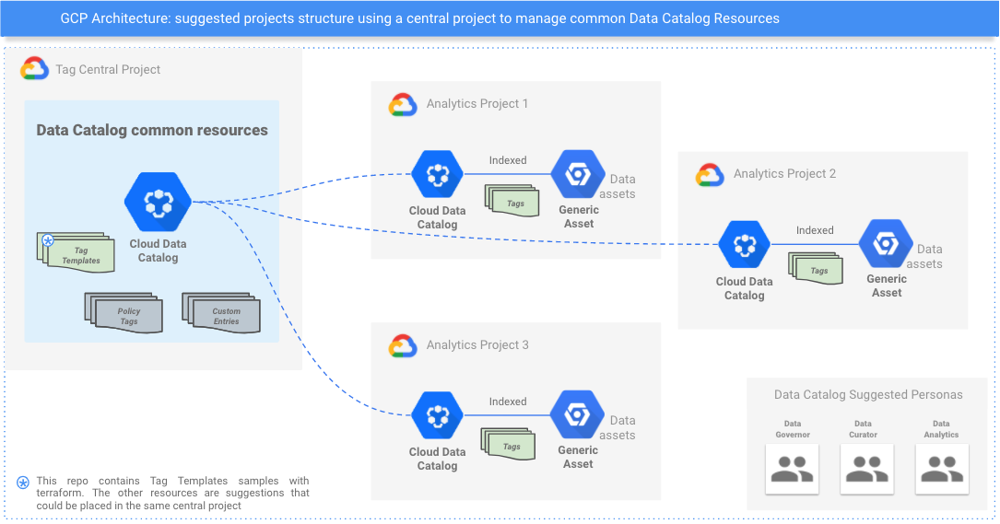

# google-datacatalog-governance-best-pratices

Repo with scripts and automations to help ensure best practices in Google Data Catalog

**Disclaimer: This is not an officially supported Google product.**

**Samples**:

- [Tag Central](tag-central/README.md) 
     
    Sets up a Tag Central project with Tag Templates, and sets the IAM permissions for 3 personas: 
    1. Data Governor
        * Has admin access to all Data Catalog resources in the Tag Central project and Analytics projects.
    1. Data Curator  
        * Discover and access metadata in Analytics projects   
        * Discover Tag Templates and use them to create tags in Analytics projects.
    1. Data Analyst
        * Discover and access metadata and created tags in Analytics projects 
        * Discover Tag Templates in the Tag Central project
