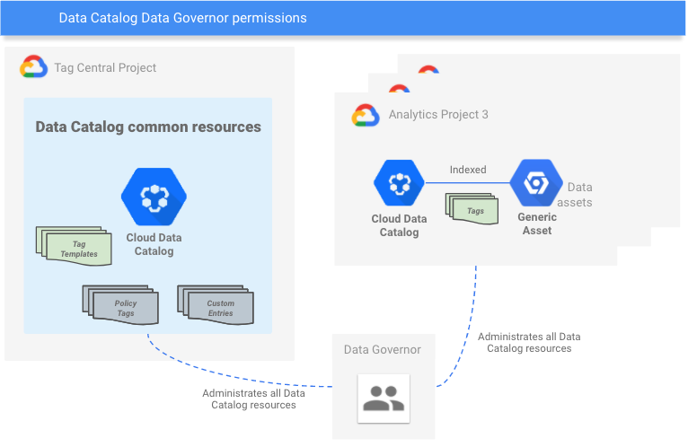
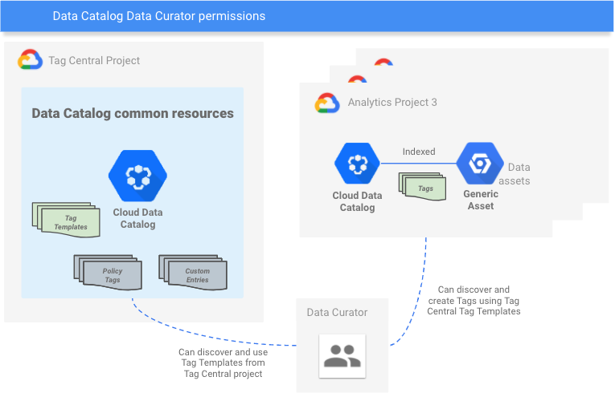
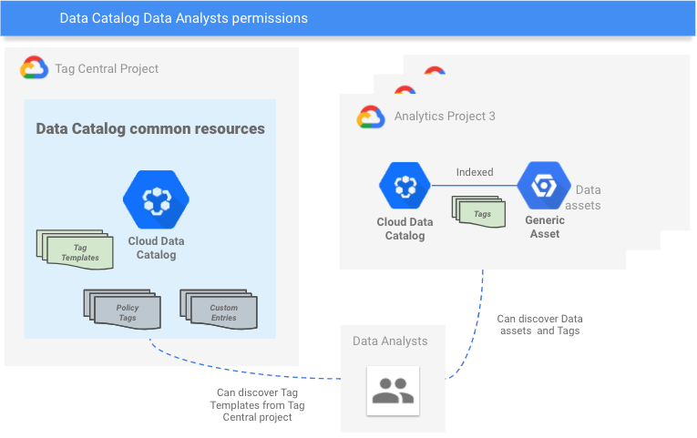

# Tag Central

Creates Data Catalog Tag Templates from [datacatalog-templates](https://github.com/GoogleCloudPlatform/datacatalog-templates) using terraform resources. It also sets up the IAM permissions for 3 personas: Data Governor, Data Curator and Data Analyst.

Follow the instructions and make sure you have set up the [.tvars](terraform/.tfvars) with your environment values before running `terraform`. The IAM members for the suggested personas can be any of: `user:{emailid}, serviceAccount:{emailid}, group:{emailid} or domain:{domain}`.

The [datacatalog_tag_template.tf](terraform/datacatalog_tag_template/main.tf) contains 4 Tag Templates: 
* Data Engineering Template
* Derived Data Template
* Data Governance Template
* Data Quality Template

They are suggestions, change the Tag Template Fields to fit your needs.

-----

<!--
  ⚠️ DO NOT UPDATE THE TABLE OF CONTENTS MANUALLY ️️⚠️
  run `npx markdown-toc -i README.md`.

  Please stick to 80-character line wraps as much as you can.
-->

## Table of Contents

<!-- toc -->

- [Detailed Permissions](#detailed-permissions)
  * [Data Governor](#data-governor)
  * [Data Curator](#data-curator)
  * [Data Analyst](#data-analyst)
- [Terraform Configuration](#terraform-configuration)
  * [Run Terraform](#run-terraform)
    + [Set terraform execution Service Account](#set-terraform-execution-service-account)
    + [Set terraform execution project](#set-terraform-execution-project)
    + [Set terraform variable placeholders](#set-terraform-variable-placeholders)
    + [Init terraform](#init-terraform)
    + [Execute terraform](#execute-terraform)
  * [Cleanup](#cleanup)

<!-- tocstop -->

-----

## Detailed Permissions

### Data Governor 
 

### Data Curator 
 

### Data Analyst
 

## Terraform Configuration

### Run Terraform

#### Set terraform execution Service Account
At the moment this guide was created, Data Catalog does not
support using end user credentials from the Google Cloud SDK. You need to set the service account before running terraform. As security best practices, we will not download the Service Account key, so we  will use Service Account impersonation in the terraform execution.

Create a Service Account with the required permissions to create Data Catalog Tag Templates.
```bash
# Change the placeholder {tag-central-project-id}
export GOOGLE_CLOUD_PROJECT={tag-central-project-id}
export SA_NAME=terraform-dc-resources-sa

# Create Service Account
gcloud iam service-accounts create $SA_NAME \
--display-name  "Service Account to create DC Resources" \
--project $GOOGLE_CLOUD_PROJECT 

# Add Tag Template Owner role
gcloud projects add-iam-policy-binding $GOOGLE_CLOUD_PROJECT \
--member "serviceAccount:$SA_NAME@$GOOGLE_CLOUD_PROJECT.iam.gserviceaccount.com" \
--quiet \
--project $GOOGLE_CLOUD_PROJECT \
--role "roles/datacatalog.tagTemplateOwner"
```

#### Set terraform variable placeholders

Go to [.tvars](terraform/.tfvars) and change the placeholders:

1. `tag_central_project_id` to your Tag Central Project
1. `datacatalog_analytics_projects_id` to the list of Analytics Projects split by comma
1. `tag_template_region` to the region you want the sample templates to be created
1. `datacatalog_data_governor_members` to the list of data governor members split by comma
1. `datacatalog_data_curator_members` to the list of data curator members split by comma
1. `datacatalog_data_analyst_members` to the list of data curator analyst split by comma

Example of a valid configuration:
```text
tag_central_project_id="tag-central-project"

datacatalog_analytics_projects_id=["my-analytics-project-1","my-analytics-project-2"]

datacatalog_resources_sa_name="terraform-dc-resources-sa"

tag_template_region="us"

datacatalog_data_governor_members=["user:john_data_governor@datacompany.com", "group:data_governors@datacompany.com"]

datacatalog_data_curator_members=["user:john_data_curator@datacompany.com", "group:data_curators@datacompany.com"]

datacatalog_data_analyst_members=["user:john_data_analytic@datacompany.com", "group:data_analytics@datacompany.com"]
```

> member can be any of: user:{emailid}, serviceAccount:{emailid}, group:{emailid} or domain:{domain}  

Run the following commands inside the [terraform](terraform) directory.

#### Init terraform
After that, let's get Terraform started. Run the following to pull in the providers.

```bash
terraform init
```

#### Execute terraform
With the providers downloaded and a project set, you're ready to use Terraform. Go ahead!

```bash
terraform plan -input=false -out=tfplan -var-file=".tfvars" 
terraform apply tfplan
```

### Cleanup

Run the following to remove the resources Terraform provisioned:

```bash
terraform destroy -var-file=".tfvars"
```
```bash
yes
```

